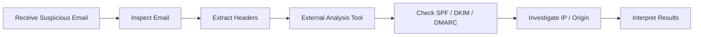
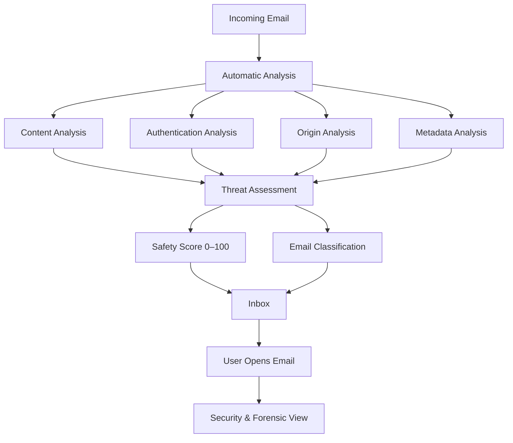
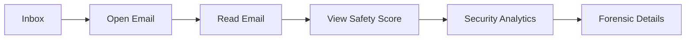
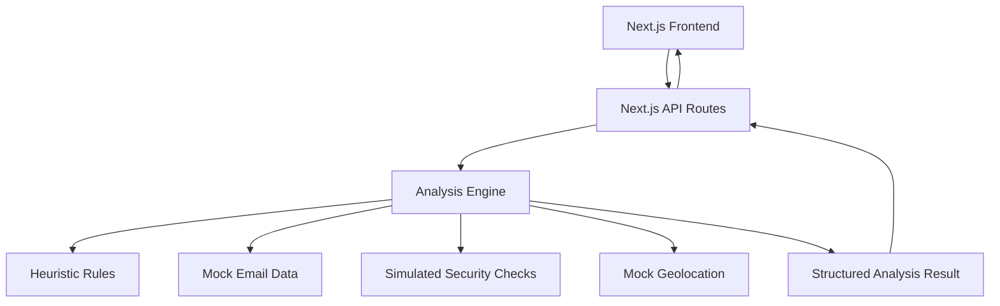
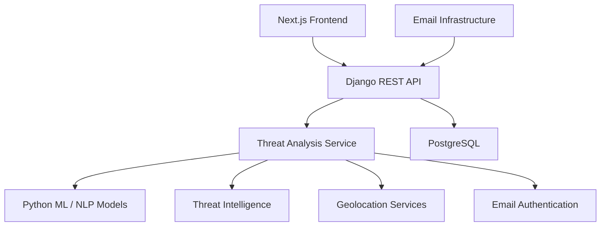
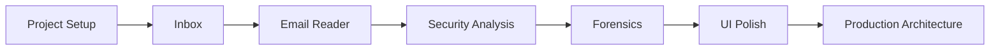

# Cyber Leek

### Secure-by-Design Email Client

> **AI-powered email threat detection, geolocation & forensic intelligence — integrated directly into the email experience.**

[](https://nextjs.org/)
[](https://www.typescriptlang.org/)
[](https://tailwindcss.com/)
[](https://motion.dev/)
[](https://tanstack.com/query)
[](https://sih.gov.in/)

---

## Overview

**Cyber Leek** is a secure-by-design webmail client developed for **Smart India Hackathon 2026 — Problem Statement SIH26106**.

Existing email-security solutions are often fragmented. Users may have to leave their email client, upload messages or headers to external services, investigate authentication results separately, and manually research suspicious origins.

Cyber Leek, my team's solution, takes a different approach:

> **Security analysis is built directly into the email client.**

Users can read their emails normally while the system automatically analyzes messages, categorizes them, assigns a **0–100 Safety Score**, identifies threats, validates email authentication, and provides origin and forensic information.

The objective is to make email security **automatic, understandable, and available by default**.

---

## The Problem

Traditional email security workflows can require users to perform multiple separate investigations:



This fragmented workflow creates unnecessary friction and assumes that the user understands email security and digital forensics.

Cyber Leek aims to consolidate this workflow into the email client itself.

---

## Our Approach

Instead of:

```text
Email Client
     +
Separate Security Tools
     +
Separate Forensic Tools
```

Cyber Leek provides:

```text
                    ┌─────────────────────────┐
                    │      Cyber Leek         │
                    │                         │
                    │      Webmail Client     │
                    │            +            │
                    │    Security Analysis    │
                    │            +            │
                    │  Forensic Intelligence  │
                    └─────────────────────────┘
```

The user does not need to manually upload an email or copy its headers into another website.

The security layer is part of the mailbox itself.

---

# Core Workflow



---

# Key Features

## Secure Webmail Experience

Cyber Leek is fundamentally an **email client**, not an email-upload analyzer.

Users can:

- Browse their inbox
- Open and read emails
- Reply to messages
- Forward messages
- Navigate between mailbox sections
- View security information directly within the email experience

Security analysis is integrated into the normal workflow.

---

## Automatic Email Classification

Emails are automatically categorized according to their nature and security characteristics.

Current categories include:

| Category | Description |
|---|---|
| **Normal** | Regular legitimate communication |
| **Promotional** | Marketing, offers, newsletters and sponsored content |
| **Spam** | Unsolicited or unwanted messages |
| **Suspicious** | Messages containing unusual or potentially risky characteristics |
| **Malicious** | Messages exhibiting strong indicators of malicious intent |

### Category ≠ Safety Score

These two concepts are deliberately separated.

For example:

```text
Category:
PROMOTIONAL

Safety Score:
94 / 100
```

The email can be promotional while still being highly trustworthy.

The category describes **what the email is**.

The Safety Score describes **how risky the email is**.

---

# Safety Score

Every analyzed email receives a **0–100 Safety Score**.

```text
100 ───────────────────── SAFE
 75 ───────────────────── LOW RISK
 50 ───────────────────── MODERATE RISK
 25 ───────────────────── HIGH RISK
  0 ───────────────────── CRITICAL RISK
```

Example:

```text
┌──────────────────────────────┐
│                              │
│          92 / 100            │
│             SAFE             │
│                              │
└──────────────────────────────┘
```

The score is supported by an explanation of the factors that contributed to the assessment rather than functioning as an unexplained number.

---

# Threat Detection

Cyber Leek can surface indicators including:

- Phishing
- Sender impersonation
- Suspicious links
- Suspicious attachments
- Urgency-based manipulation
- Authentication failures
- Header anomalies
- Domain inconsistencies
- Other suspicious sender or content patterns

Threat indicators are surfaced directly in the email experience.

---

# Email Authentication

The security analysis includes:

### SPF

Determines whether the sending server is authorized to send mail for the domain.

### DKIM

Checks the presence and validity of cryptographic email signatures.

### DMARC

Evaluates domain alignment and authentication policy.

Example:

```text
SPF       ✓ PASS
DKIM      ✓ PASS
DMARC     ✕ FAIL
```

These results contribute to the broader security assessment rather than being treated as the sole indicator of whether an email is safe.

---

# Origin & Geolocation Intelligence

Cyber Leek can analyze relevant email metadata and header information to surface origin information.

The interface can present:

- Origin IP
- Country
- Region
- City
- ISP / organization
- Approximate geographical location

Example:

```text
Origin IP
185.xxx.xxx.xxx

Location
Moscow, Russia

Network
Example ISP
```

> Geolocation is an investigative signal. It should not be interpreted as definitive proof of an attacker's physical location.

---

# Forensic Analysis

Users can move beyond the simple question:

> **"Is this email safe?"**

and investigate:

> **"Why was this email considered risky?"**

The forensic view can expose:

- Safety Score breakdown
- Threat indicators
- SPF / DKIM / DMARC results
- Technical metadata
- Email headers
- Origin information
- Analysis explanations
- Risk factors

---

# User Experience

The intended interaction model is:



### Inbox

The inbox provides an immediate overview of:

- Sender
- Subject
- Preview
- Category
- Safety Score
- Security status

### Email View

Opening an email provides the complete message together with its security context.

### Security Analytics

Selecting the Safety Score opens a deeper analysis interface containing the technical and forensic details behind the assessment.

---

# Prototype Architecture

The current prototype is intentionally designed to demonstrate the complete product experience without requiring production-scale infrastructure.



## Architecture Layers

### Frontend

Responsible for:

- UI rendering
- Navigation
- User interaction
- Email presentation
- Security visualizations
- Animations

### API Layer

Responsible for:

- HTTP endpoints
- Request validation
- Retrieving email data
- Calling the analysis engine
- Returning structured results

### Analysis Engine

Responsible for:

- Threat analysis
- Categorization
- Safety Score calculation
- Security checks
- Forensic information
- Geolocation information

The analysis engine is deliberately separated from the UI so that the implementation can evolve independently.

---

# Technology Stack

| Layer | Technology |
|---|---|
| Framework | Next.js |
| Language | TypeScript |
| UI | React |
| Styling | Tailwind CSS |
| Components | shadcn/ui |
| Animation | Framer Motion |
| Data Fetching | TanStack Query |
| Validation | Zod |
| API | Next.js API Routes |
| Version Control | Git / GitHub |

---

# Project Structure

```text
Integrated-EmailClient/
│
├── app/
│   ├── api/
│   │   └── emails/
│   │       ├── route.ts
│   │       └── [id]/
│   │           └── route.ts
│   │
│   ├── email/
│   │   └── [id]/
│   │       └── page.tsx
│   │
│   ├── layout.tsx
│   └── page.tsx
│
├── components/
│   ├── inbox/
│   ├── email-view/
│   └── ui/
│
├── lib/
│   ├── api/
│   ├── analysis/
│   │   ├── rules/
│   │   └── mock/
│   └── types.ts
│
├── public/
│
├── package.json
├── tsconfig.json
└── README.md
```

---

# Prototype Scope

The current prototype uses controlled sample data and simplified analysis to demonstrate the intended experience.

### Implemented / Demonstrated

- Webmail inbox
- Email navigation
- Email categorization
- Safety Score
- Threat indicators
- Security analysis
- SPF / DKIM / DMARC simulation
- Origin information
- Geolocation representation
- Forensic analysis
- Responsive UI
- Animated interactions

### Currently Simulated

- Real email accounts
- IMAP / SMTP integration
- Machine-learning inference
- Real-time threat intelligence
- Production IP geolocation services
- Database persistence
- Real-time email delivery
- User authentication

The prototype focuses on demonstrating the **product experience and system architecture** before implementing production-scale infrastructure.

---

# Future Architecture

The intended system can evolve from the current prototype toward a dedicated Python/Django backend and real security infrastructure.



The frontend should remain largely independent from the underlying analysis implementation.

The current TypeScript analysis engine is a **prototype implementation**. A future Python implementation can preserve the same conceptual data contract while replacing the underlying analysis logic with ML/NLP models and external intelligence services.

---

# Sample Threat Scenarios

The prototype uses realistic scenarios to demonstrate different security states.

| Scenario | Example Classification | Example Score |
|---|---|---:|
| Normal business email | Normal | 95 |
| Legitimate newsletter | Promotional | 85 |
| Marketing campaign | Promotional | 75 |
| Unsolicited message | Spam | 40 |
| Phishing attempt | Malicious | 5 |
| CEO impersonation | Suspicious | 15 |
| Suspicious attachment | Suspicious | 50 |
| Compromised account | Malicious | 10 |
| Fake invoice | Malicious | 25 |
| Legitimate account verification | Normal | 85 |

> Scores shown above are representative prototype values and do not represent a production threat-detection model.

---

# Running Locally

## Prerequisites

Make sure you have:

- [Node.js](https://nodejs.org/)
- npm
- Git

## Clone the Repository

```bash
git clone https://github.com/nexeve/Security-Integrated-Email-Client.git
cd Security-Integrated-Email-Client
```

## Install Dependencies

```bash
npm install
```

## Start the Development Server

```bash
npm run dev
```

The application will be available at:

```text
http://localhost:3000
```

## Environment Configuration

Create a `.env.local` file in the project root with the following variables:

```bash
# Google OAuth 2.0 Credentials (for Gmail API integration)
GOOGLE_CLIENT_ID="your-google-client-id"
GOOGLE_CLIENT_SECRET="your-google-client-secret"
GOOGLE_REDIRECT_URI="http://localhost:3000/api/auth/google/callback"

# Session Encryption Key
SESSION_SECRET="your-32-byte-secure-random-secret"

# Optional: Threat Intelligence Feeds
SAFE_BROWSING_API_KEY=""
```

## Testing & Quality Checks

Run the test suite:

```bash
npm test
```

Run TypeScript compilation and linter:

```bash
npx tsc --noEmit
npm run lint
```

Build for production:

```bash
npm run build
```

---

# Development Workflow

The project is being developed incrementally around a working vertical slice:



The immediate objective is to create a convincing prototype demonstrating the complete security-aware email workflow.

---

# Why Cyber Leek?

Cyber Leek is built around a simple principle:

> **Email security should not require the user to become a security analyst.**

Instead of asking users to manually investigate suspicious messages, security analysis should happen as part of the email experience.

The long-term vision is a mailbox where:

- Threats are identified automatically.
- Suspicious messages are clearly surfaced.
- Security decisions are explainable.
- Origin information is accessible.
- Forensic investigation is available when required.
- Security is built into the experience rather than added as an external tool.

---

# Smart India Hackathon 2026

| | |
|---|---|
| **Event** | Smart India Hackathon 2026 |
| **Problem Statement** | SIH26106 |
| **Category** | Software |
| **Project** | Cyber Leek |
| **Focus** | AI-Powered Email Threat Detection, Geolocation & Forensic Intelligence |

---

# Project Status

> **Prototype / MVP — Actively Under Development**

The current version focuses on validating the integrated webmail and security-analysis experience.

Future development will focus on:

- Real email ingestion
- Production authentication
- ML/NLP threat classification
- Real SPF/DKIM/DMARC validation
- Real IP geolocation
- Threat intelligence integration
- Persistent storage
- Scalable backend infrastructure

---

## License

This project is currently developed as a prototype for **Smart India Hackathon 2026**.

License information will be added as the project moves toward public release.